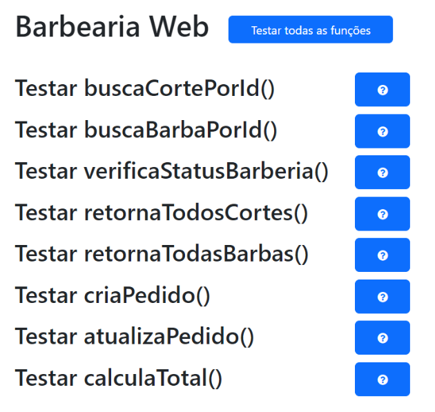

# Barbearia web

  

## Descrição

Um de seus clientes é barbeiro, sua babearia oferece cortes de cabelo e, claro, barba.

Com a alta demanda ele não está conseguindo dar conta de atender todos os clientes.

Com a grande dificuldade em atender todas as demandas dos clientes, ele te contratou para desenvolver um sistema onde o cliente poderá realizar uma série de ações,como:

## Features

- **Funções criadas:**

-Buscar Corte.

-Buscar Barba.

-Consultar se a barbearia está aberta ou fechada.

-Buscar todos os cortes que a barbearia oferece.

-Buscar todas as barbas que a barbearia oferece.

-Orçar um pedido.

-Atualizar serviço.

-Calcular o valor total.